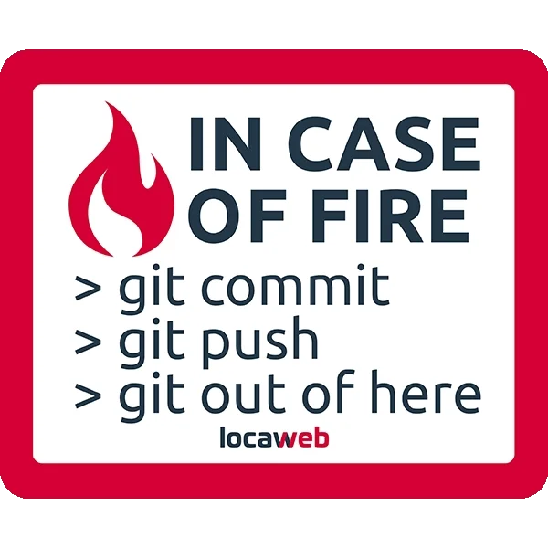

<!-- Header -->
<div align='center'>
  
  [](https://git.io/typing-svg)
  <br />
  
</div>

<br />

<!-- About me -->
<details align='center'>
  <summary>
    
    About me
  </summary>
  <samp>
  <br />
  <div align='left'>

   ```js
   const AcJoell = {
    name: 'Joel Acosta',
    code: ['JavaScript', 'Java', 'PHP', 'HTML', 'CSS'],
    technologies: {
      frontEnd: {
        js: ['React'],
        css: ['CSS', 'Bootstrap', 'Tailwind', 'DaisyUI']
      },
      databases: ['MongoDB','MySQL'],
      misc: ['firebase', 'vercel']
    },
    projects: [
      {name:'DIIART', tech:'MongoDB, Express, React, Node'},
      {name:'Portfolio', tech:'React'}
    ],
    occupation: 'Frontend Developer'
  }
   ```

  </div> 
  </samp>
</details>

<br />

<!-- Stack -->
<details align='center'>
  <summary>
    
    Languages & Tools
  </summary>
  <samp>
  <br />
  <div display='flex' gap='10px'>
    
    
    
    
    
    
    
    
    
    
    <!--
    
    
    
     
    -->
  </div>
  </samp>
</details>

<br />

<!-- Active Repo -->
<details align='center'>
  <summary>
    
    Active Repositories
  </summary>
  <samp>
  <br />
   <div display='flex'>
      <a href='https://github.com/AcJoell/startReact' align='left' widht='33%'>
        
      </a>
      <a href='https://github.com/No-Country/C6-04' align='center' widht='33%'>
        
      </a>
      <a href='https://github.com/AcJoell/JS-projects' align='right' widht='33%'>
        
      </a>
   </div>
  </samp>
</details>

<br />

<!-- Contact -->
<details align='center'>
  <summary>
    
    You can reach me on
  </summary>
  <samp>
  <br />
  <a href='https://in.linkedin.com/in/acjoell'>
    
  </a>
  <a href='https://twitter.com/acjoell'>
    
  </a>
  <a href='https://www.instagram.com/acjoell'>
    
  </a>
  <a href='mailto:joelac04@hotmail.com'>
    
  </a>
  </samp>
</details>

<br />

<!-- Stats -->
<details align='center'>
  <summary>
    
    GitHub Stats
  </summary>
  <samp>
    <br />
    
    <br />
    
    <br />
    
  </samp>
</details>

<br />

<!-- Alert -->
<details align='right'>
  <summary>
      
  </summary>
  <samp>
    “ Anything you don't learn is indistinguishable from magic. ”</code><strong> - Kyle S. </strong>
  </samp>
</details>
